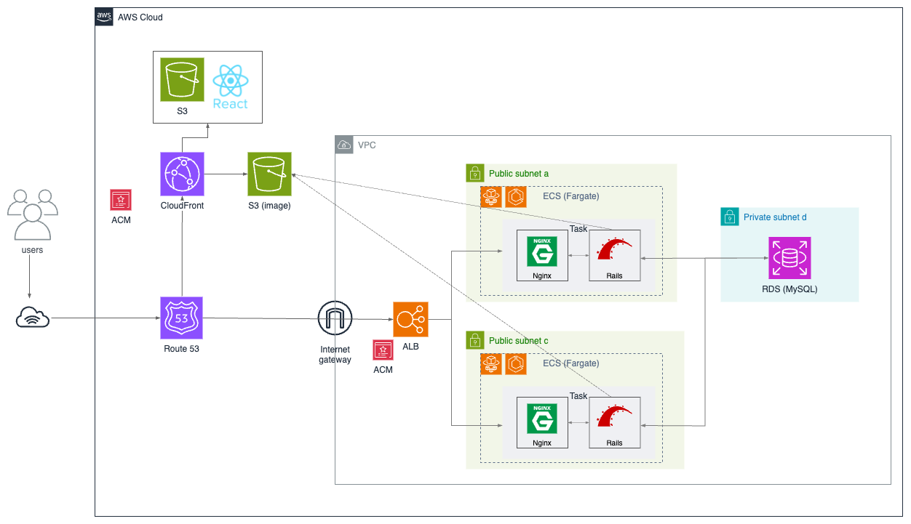

# PressurePot Recipes

電気圧力鍋を使ったレシピを投稿することができるアプリケーションを作成しました。

~~URL：https://web.pp-recipes.com~~
公開停止しました(2024.2.15)

ゲストアカウント

```
メールアドレス：test@test.com
パスワード：password
```

ポートフォリオの詳細は以下の Qiita に記載しております！
https://qiita.com/skysky0208/private/f1658463390959e60974

## 1. 背景

このアプリケーションを作ろうとしたきっかけは、自身が電気圧力鍋にはまっており、レシピを探そうとした時にふと感じた課題を解決したいと感じたためです。
その時に感じた課題が以下になっています。

- 普通のレシピと圧力鍋のレシピが混じっていて探しにくい
- 普通のレシピを検索する際と見る視点が異なる
  - 圧力鍋のレシピを探すときは、圧力鍋に材料を入れるまでの調理とボタンを押した後の加圧にプロセスが分かれる
  - 電気圧力鍋の強みとして、この前半の調理のみでほぼ料理が完了する
  - そのため、鍋に入れ込むまでの調理が簡単な料理を探したい

この原体験をもとに、課題が解消されるようなアプリケーションを作ろうと決めました。

## 2. アプリケーション機能

### ユーザに関する機能

- ユーザ新規登録
- ユーザログイン/ログアウト
- アカウント情報編集
- マイページ表示

### レシピに関する機能

- レシピ投稿/編集/削除
- 下書き機能
- 画像プレビュー(トリミングあり)
- レシピ一覧/詳細
- レシピ検索機能
- お気に入り機能

## 2.使用技術

- React
  - Node 16.10.0
  - React 18.2.0
  - TypeScript 4.4.2
  - ESLint
  - Prettier
- Rails (API モード)
  - Ruby 3.1.0
  - Rails 6
- AWS
  - VPC
  - ECS(Fargate)
  - Route53
  - CloudFront
  - LoadBlancer
  - Certificate Manager
  - S3
  - RDS(MySQL 8.0)
- Docker / Docker Compose
- MySQL 8.0

### インフラ構成図


